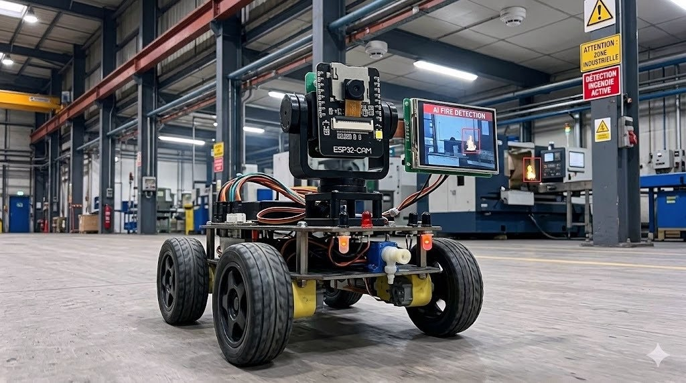
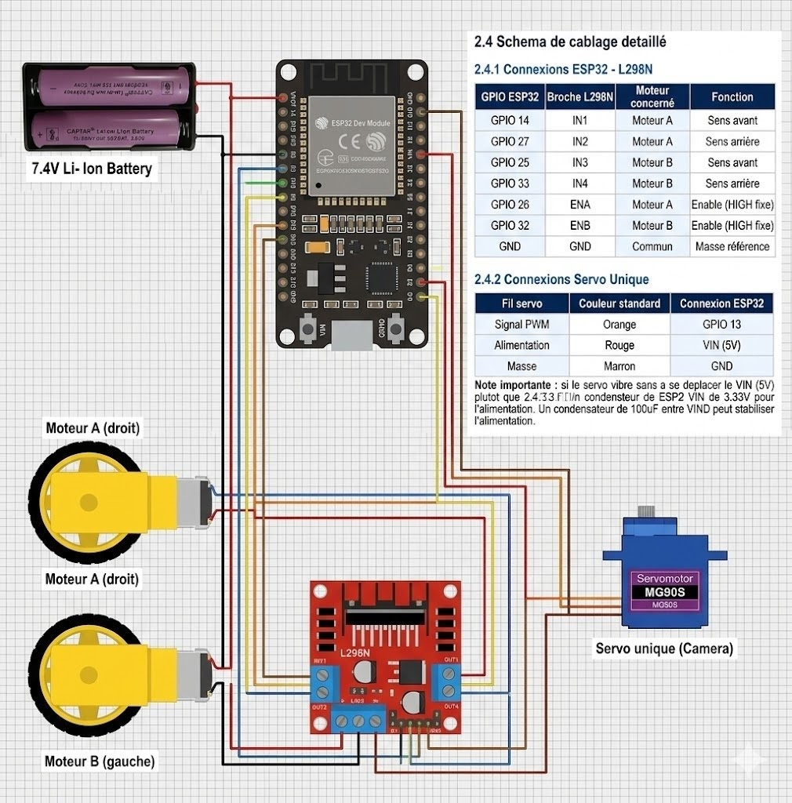
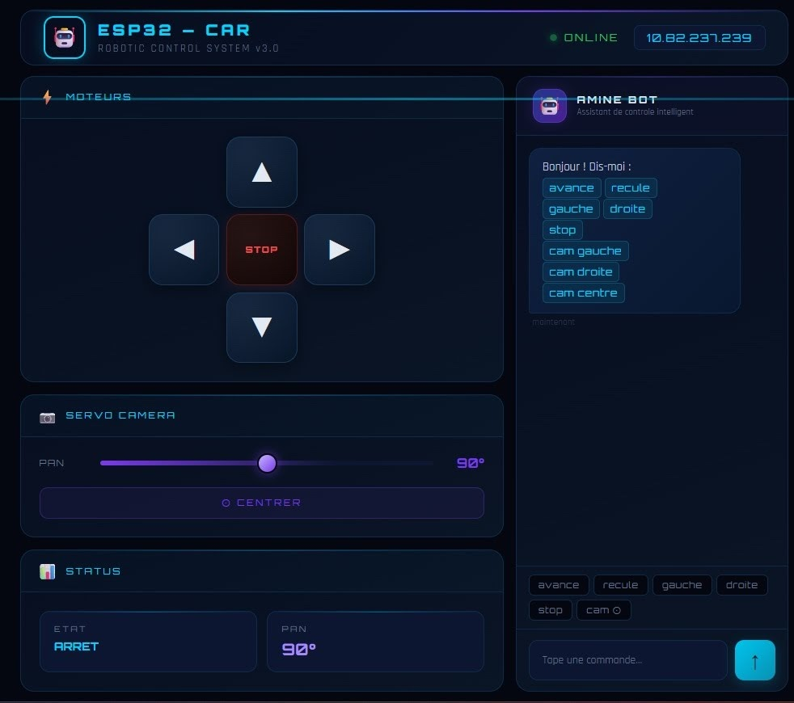
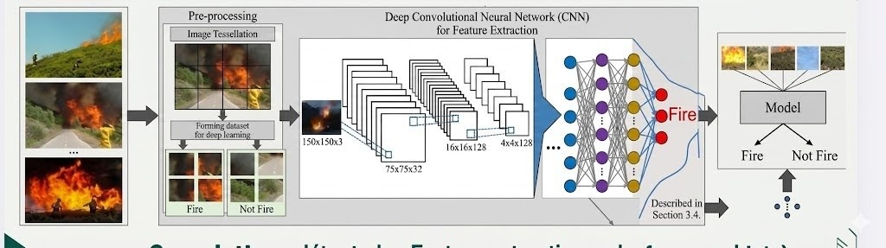
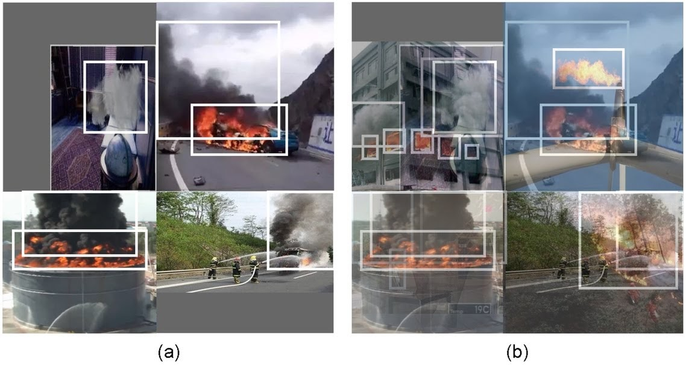
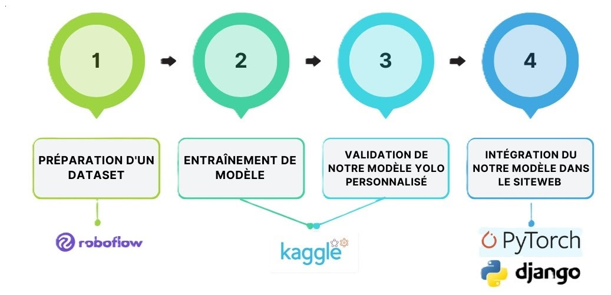

# 🔥 FireBot — AI-Powered Fire Detection Robot Car

> An intelligent mobile robot combining **IoT**, **Computer Vision**, and **Deep Learning** for real-time fire detection in industrial environments.

---

---

## 📋 Table of Contents

- [Overview](#overview)
- [System Architecture](#system-architecture)
- [Hardware Components](#hardware-components)
- [Wiring & Connections](#wiring--connections)
- [Web Control Interface](#web-control-interface)
- [AI Fire Detection Model](#ai-fire-detection-model)
- [Edge Impulse Model](#edge-impulse-model)
- [Repository Structure](#repository-structure)

---

## Overview

Industrial fires cause significant economic losses, halt production, and endanger workers. Existing fixed smoke detectors cannot localize the fire source. **FireBot** solves this by combining a mobile robotic platform with an onboard AI vision system capable of detecting and localizing flames in real time.

The system integrates:
- **ESP32 DevKit** — robot brain and motor control
- **ESP32-CAM** — live video capture and Wi-Fi video streaming
- **PyTorch CNN model** — deep learning fire classifier (96% accuracy on fire class)
- **Python inference server** — real-time frame processing and alert generation
- **Web dashboard** — full remote control with an AI assistant chatbot

---

## System Architecture

The full pipeline works as follows:

1. The ESP32-CAM captures a continuous video stream and transmits frames over Wi-Fi
2. A Python server receives the frames and runs inference through the PyTorch model
3. If fire is detected, an alert is generated and displayed on the web interface
4. The operator commands the robot to navigate toward the fire source

---

## Hardware Components

| Component | Role |
|-----------|------|
| ESP32-CAM | Vision + video streaming |
| ESP32 DevKit | Robot brain — motor & servo control |
| L298N Motor Driver | Controls 2 DC motors |
| 2x DC Motors | Robot locomotion |
| MG90S Servo Motor | Camera pan orientation |
| 7.4V Li-Ion Battery | Power supply |

---

## Wiring & Connections

### ESP32 to L298N Motor Driver

| GPIO ESP32 | L298N Pin | Motor | Function |
|------------|-----------|-------|----------|
| GPIO 14 | IN1 | Motor A | Forward |
| GPIO 27 | IN2 | Motor A | Backward |
| GPIO 25 | IN3 | Motor B | Forward |
| GPIO 33 | IN4 | Motor B | Backward |
| GPIO 26 | ENA | Motor A | Enable (HIGH) |
| GPIO 32 | ENB | Motor B | Enable (HIGH) |
| GND | GND | Common | Ground reference |

### Servo Motor Camera Pan

| Wire | Color | ESP32 Connection |
|------|-------|-----------------|
| PWM Signal | Orange | GPIO 13 |
| Power | Red | VIN (5V) |
| Ground | Brown | GND |

> **Note:** If the servo vibrates without moving, use VIN (5V) instead of the 3.3V pin. A 100uF capacitor on VIN can stabilize the supply.

---

## Web Control Interface

The robot is controlled through a custom **ESP32-hosted web dashboard** accessible on the local network. Features include:

- Directional controls (Forward / Backward / Left / Right / Stop)
- Camera pan slider (0 to 180 degrees) with center reset button
- Real-time status display (state + servo angle)
- **AMINE BOT** — an AI chat assistant that accepts natural language commands: avance, recule, gauche, droite, cam gauche, cam droite, cam centre

---

## AI Fire Detection Model

The fire detection engine is built on a **Convolutional Neural Network (CNN)** trained with **PyTorch**, following a rigorous deep learning pipeline purpose-built for industrial visual inspection.

### CNN Architecture

The network is structured as a hierarchical feature extraction pipeline followed by a multi-class decision head:

- **Convolutional layers** — apply learned filter banks across the spatial domain of each input frame to extract low-level features (edges, color gradients, texture patterns) and progressively compose them into high-level semantic representations such as flame contours and smoke plumes. Each layer applies a **ReLU** non-linearity to introduce representational power and allow the model to learn non-linear decision boundaries.
- **Pooling layers (Max Pooling)** — perform spatial downsampling by retaining the dominant activation within each receptive field. This reduces the feature map resolution, decreasing computational cost while enforcing **translational invariance** — meaning the model correctly identifies fire regardless of its position in the frame.
- **Fully Connected layers** — flatten the learned spatial representations into a fixed-length feature vector and perform the final classification. The output layer applies a **Softmax** activation to produce a calibrated probability distribution across the three classes.

The input pipeline pre-processes each frame through **image tessellation** — dividing the frame into a grid of 150x150x3 patches — which improves detection of small, localized flame regions that would otherwise be missed at full resolution.

### Dataset Classes

The model was trained to distinguish between **3 classes**:

| Class | Description | Label color |
|-------|-------------|-------------|
| fire | Visible flames, fire sources | Red |
| not fire | Normal scenes, no fire | Yellow |
| background | Empty background, no object of interest | none |

### Dataset Preparation

The dataset was assembled using **Roboflow** and **Kaggle** (Fire Detection from CCTV), following embedded AI engineering best practices:

- Diverse image variety (different fire types, angles, lighting conditions, indoor/outdoor)
- 3000 annotated bounding boxes per class
- 0 to 10 percent background-only images to minimize the false positive rate in production

### Training Pipeline

| Step | Tool | Description |
|------|------|-------------|
| 1 | Roboflow | Dataset curation, annotation, augmentation |
| 2 | Kaggle (GPU) | Model training with cross-entropy loss + Adam optimizer |
| 3 | Kaggle | Validation — confusion matrix, precision/recall evaluation |
| 4 | PyTorch | Model export (.pt) and integration into the Python inference server |

### Model Performance

Evaluated on a 3000-image held-out test set:

| Class | Precision |
|-------|-----------|
| Fire | 0.96 |
| Not Fire | 0.93 |
| Background | — |

The normalized confusion matrix confirms strong generalization with minimal false negatives on the fire class — the most safety-critical metric for industrial deployment.

---

## Edge Impulse Model

In addition to the PyTorch CNN, a parallel model was developed using **Edge Impulse** — a platform optimized for embedded machine learning on resource-constrained microcontrollers.

Live Edge Impulse Project: https://studio.edgeimpulse.com/public/914533/live

### PyTorch Model vs Edge Impulse Model

| Feature | PyTorch Model | Edge Impulse Model |
|---------|--------------|-------------------|
| Platform | Python server (PC) | Embedded MCU (ESP32-CAM) |
| Inference location | Server-side | On-device (edge) |
| Latency | Low (network-dependent) | Very low (local) |
| Model size | Larger (.pt file) | Optimized (int8 quantized) |
| Accuracy | Higher (more compute available) | Slightly lower (hardware constraints) |
| Connectivity required | Yes (WiFi to server) | No (fully autonomous) |
| Best use case | High-accuracy detection with PC | Fully standalone embedded system |

The **PyTorch approach** delivers higher accuracy and flexibility. The **Edge Impulse approach** makes the robot fully autonomous without needing a PC server — ideal for production deployment.

---

## Future Improvements

- Replace ESP32-CAM with Raspberry Pi 4B and wide-angle camera for HD inference
- Run YOLOv8 directly on-device for real-time object detection
- Add Firebase integration for cloud alerts and remote monitoring
- Integrate an automatic fire suppression module (pump + water reservoir)
- Implement autonomous navigation with obstacle avoidance sensors

---

## Repository Structure
